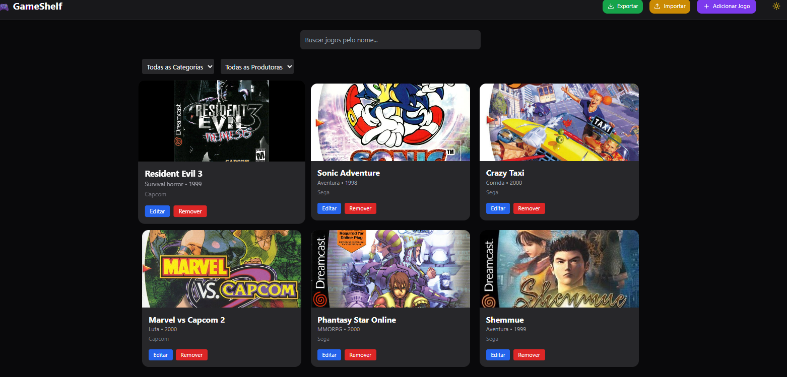

# 🎮 GameShelf

> Um gerenciador moderno e estiloso para sua coleção de jogos, feito com React + Vite + Tailwind + TypeScript. Sem banco de dados — tudo salvo no seu navegador!

 <!-- Substitua por um print do projeto -->

---

## ✨ Destaques

- ✅ Adicionar, editar e excluir jogos
- 🖼️ Upload de imagem direto no navegador (base64)
- 🗂️ Filtros por categoria e produtora
- 🔎 Barra de busca por nome
- 🌗 Dark Mode com toggle
- 💾 Exportar/importar coleção `.json`
- 🎞️ Animações com Framer Motion
- 🚀 Deploy com Vercel
- ⚡️ Performance com Vite

---

## 🛠 Tecnologias

- [React](https://reactjs.org/)
- [Vite](https://vitejs.dev/)
- [TypeScript](https://www.typescriptlang.org/)
- [Tailwind CSS](https://tailwindcss.com/)
- [React Hook Form](https://react-hook-form.com/)
- [Zod](https://zod.dev/)
- [Framer Motion](https://www.framer.com/motion/)
- [React Router](https://reactrouter.com/)
- [Vercel](https://vercel.com/) (Deploy)

---

## 🚀 Como rodar localmente

```bash
# 1. Clone o repositório
git clone https://github.com/SEU_USUARIO/gameshelf.git
cd gameshelf

# 2. Instale as dependências
npm install

# 3. Inicie o projeto
npm run dev
